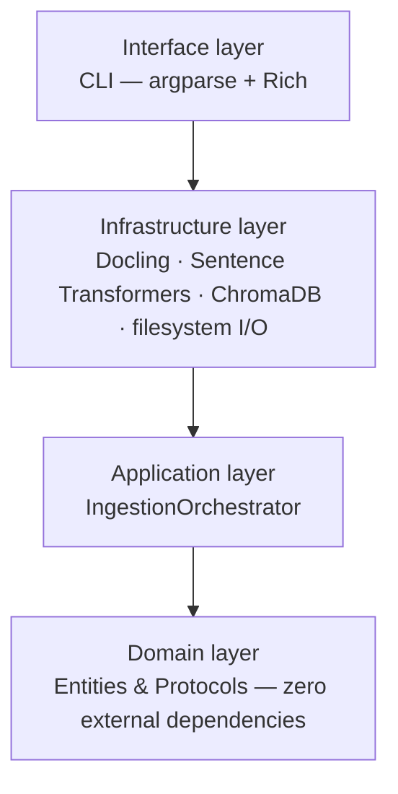
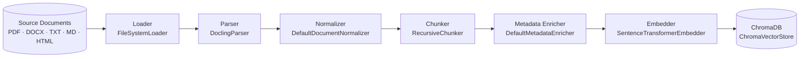

# RAG Ingestion Pipeline

*A production-grade RAG ingestion pipeline built on Clean Architecture — seven independently testable pipeline stages, deterministic content hashing, and a test suite larger than the source code it verifies.*

[](https://www.python.org/)
[](LICENSE)
[](https://docs.astral.sh/ruff/)
[](https://mypy-lang.org/)
[](#testing)

## Overview

Retrieval-Augmented Generation (RAG) systems are only as reliable as the pipeline that fills their vector store. Most ingestion code starts life as a single script or notebook and never grows past it — untyped, untested, and one malformed PDF away from a failed run.

**RAG Ingestion** takes the opposite approach. Raw documents — PDF, DOCX, TXT, Markdown, HTML — go in; deterministically-identified, metadata-rich embeddings in [ChromaDB](https://www.trychroma.com/) come out. It's built the way a production data service would be: Clean Architecture with a strict dependency rule, every pipeline stage defined as a swappable `Protocol`, structured logging, environment-driven configuration, and a test suite that's larger than the source code it verifies.

Parsing is delegated to [Docling](https://github.com/docling-project/docling), embeddings to [Sentence Transformers](https://www.sbert.net/), and vector storage to ChromaDB — but none of those choices leak outside the infrastructure layer. Swapping any one of them out is a one-file change.

## Table of Contents

- [Overview](#overview)
- [Architecture](#architecture)
- [Engineering Highlights](#engineering-highlights)
- [Tech Stack](#tech-stack)
- [Getting Started](#getting-started)
- [Usage](#usage)
- [Configuration](#configuration)
- [Project Structure](#project-structure)
- [Testing](#testing)
- [Code Quality](#code-quality)
- [Roadmap](#roadmap)
- [Contributing](#contributing)
- [License](#license)
- [Author](#author)

## At a Glance

| Metric | Detail |
|---|---|
| **Architecture** | Clean Architecture — Domain → Application → Infrastructure → Interface |
| **Pipeline** | 7 stages: Load → Parse → Normalize → Chunk → Enrich → Embed → Store |
| **Test suite** | 182 test functions, ~3,460 lines — more test code than source (~2,960 lines) |
| **Type safety** | Fully annotated, enforced with `mypy --strict` |
| **Formats supported** | PDF · DOCX · TXT · Markdown · HTML |
| **Extensibility** | Every stage is a `Protocol` — swap any adapter without touching the orchestrator |

## Architecture

The codebase follows Clean Architecture. Dependencies point in one direction only, inward toward the domain — the [domain layer](src/rag_ingestion/domain) has zero knowledge that Docling, ChromaDB, or Sentence Transformers exist, and never will:



Every concrete adapter fulfills a [`typing.Protocol`](src/rag_ingestion/domain/protocols) contract defined in the domain layer, and the [`IngestionOrchestrator`](src/rag_ingestion/application/orchestrators/ingestion.py) only ever talks to those protocols — never to a concrete class:



Every box on the right is a concrete class implementing the protocol named above it; none of them know the others exist. Adding a new vector store means writing one new adapter class and changing one line in [`bootstrap.py`](src/rag_ingestion/bootstrap.py) — the single composition root described below.

## Engineering Highlights

Specific decisions worth knowing about, roughly in order of "why this is harder to build well than it looks":

- **Protocol-driven ports & adapters.** Every stage — `Loader`, `Parser`, `Normalizer`, `Chunker`, `MetadataEnricher`, `Embedder`, `VectorStore` — is a [`typing.Protocol`](src/rag_ingestion/domain/protocols) in the domain layer. Infrastructure adapters satisfy it structurally; no base classes, no inheritance chains, no framework magic.
- **Deterministic, content-addressable IDs.** [`DefaultMetadataEnricher`](src/rag_ingestion/infrastructure/metadata_enrichers/default.py) fingerprints every document and chunk with SHA-256 over content and structural metadata, producing stable IDs in the form `{document_hash}_{chunk_index:06d}`. Identical input always yields identical IDs, so re-running ingestion on unchanged files is a safe no-op upsert, not a duplicate-generating disaster.
- **Per-document fault isolation.** [`IngestionOrchestrator.ingest()`](src/rag_ingestion/application/orchestrators/ingestion.py) wraps each document in its own `try`/`except`, records exactly which stage failed, and keeps going. One corrupted PDF in a 10,000-document batch produces one structured `IngestionFailure` entry, not a crashed run.
- **A hand-rolled recursive chunker.** Rather than pulling in a framework for one function, [`RecursiveChunker`](src/rag_ingestion/infrastructure/chunkers/recursive.py) implements a `\n\n → \n → " " → ""` recursive-split strategy from scratch, tracking exact character offsets back to the source document and keeping section headings attached to their body text.
- **Structured logging, decoupled from UX.** Every stage emits `structlog` events (JSON or console format) to a rotating file handler, while the terminal stays clean for the Rich-rendered progress bars and summary panel. Logs are for machines; the CLI output is for humans — and neither gets in the other's way.
- **A real composition root.** [`bootstrap.py`](src/rag_ingestion/bootstrap.py) is the only module in the codebase that imports concrete infrastructure classes. Nothing else knows ChromaDB or Docling exist — textbook dependency injection, no service locator, no globals.
- **Configuration that's actually externalized.** Every tunable — chunk size, embedding model, batch size, log level, ChromaDB path — is a validated `pydantic-settings` field with typed literals. Reconfiguring a deployment never requires a code change.
- **Lazy imports for heavy dependencies.** `sentence-transformers`, `chromadb`, and Docling's converter are imported inside methods, not at module scope, so the domain and application layers stay importable — and unit-testable — independent of whichever ML libraries happen to be installed.
- **A test suite that outweighs the source.** 182 test functions across ~3,460 lines, against ~2,960 lines of source. Unit tests use hand-written stub doubles per adapter rather than heavy mocking frameworks; integration tests generate real PDF and DOCX fixtures on the fly and run them through an actual embedding model and a real ChromaDB instance.

## Tech Stack

| Concern | Technology |
|---|---|
| Language | Python ≥ 3.12.13 |
| Document parsing | [Docling](https://github.com/docling-project/docling) |
| Embeddings | [Sentence Transformers](https://www.sbert.net/) on PyTorch |
| Vector store | [ChromaDB](https://www.trychroma.com/) (persistent client) |
| Configuration & validation | Pydantic v2 + `pydantic-settings` |
| Structured logging | `structlog`, rotating file handler |
| CLI | `argparse` + [Rich](https://github.com/Textualize/rich) |
| Testing | `pytest`, `pytest-mock`, `pytest-cov` |
| Static analysis | `ruff` (lint + format), `mypy --strict` |
| Packaging & environments | [`uv`](https://docs.astral.sh/uv/), Hatchling |

## Getting Started

### Prerequisites

- Python ≥ 3.12.13
- [uv](https://docs.astral.sh/uv/) for dependency management
- Git

### Installation

```bash
git clone https://github.com/<your-username>/rag-ingestion.git
cd rag-ingestion
uv sync
```

### Configuration

```bash
cp .env.example .env
```

All configuration is environment-driven — see [Configuration](#configuration) for the full reference.

### Run

```bash
mkdir -p documents   # drop source files here, or point the CLI at another directory
uv run rag-ingestion ingest
```

The first run downloads the configured embedding model and Docling's layout models, so expect a short delay and an active internet connection the first time.

## Usage

```text
$ rag-ingestion --help
usage: rag-ingestion [-h] [--version] [--config] {ingest} ...

Production-grade RAG ingestion pipeline.

positional arguments:
  {ingest}
    ingest    Ingest documents from a directory

options:
  -h, --help  show this help message and exit
  --version   show program's version number and exit
  --config    Display the active configuration.
```

Ingest a specific directory (falls back to `DEFAULT_INPUT_DIRECTORY` when omitted):

```bash
uv run rag-ingestion ingest ./documents
```

Running `ingest` renders a live per-stage progress bar, then a summary panel. Here's what a successful run looks like:

```text
rag-ingestion v0.1.0  →  ./documents

╭──────────────── Ingestion Summary ────────────────╮
│                                                     │
│  Status                 SUCCESS                    │
│  Documents processed    128                        │
│  Chunks generated       4213                       │
│  Embeddings created     4213                       │
│  Failed documents       0                          │
│  Execution time         41.86s                     │
│  Collection             documents                  │
│  Persistence location   ./chroma                   │
│                                                     │
╰─────────────────────────────────────────────────────╯
```

If any document fails, its stage and error are listed in a dedicated failure table and the process exits non-zero — nothing fails silently.

Inspect the fully-resolved configuration at any time:

```bash
uv run rag-ingestion --config
```

## Configuration

Every setting is a validated `pydantic-settings` field defined in [`config.py`](src/rag_ingestion/config.py) and loaded from `.env` or the process environment — see [`.env.example`](.env.example) for a ready-to-copy starting point.

| Variable | Default | Description |
|---|---|---|
| `APP_NAME` | `rag-ingestion` | Application name attached to log context |
| `APP_ENV` | `development` | `development` \| `test` \| `production` |
| `APP_DEBUG` | `false` | Enable debug behaviors |
| `LOG_LEVEL` | `INFO` | `DEBUG` \| `INFO` \| `WARNING` \| `ERROR` \| `CRITICAL` |
| `LOG_FORMAT` | `json` | `json` \| `console` |
| `LOG_DIRECTORY` | `./logs` | Rotating log file location (10 MB × 5 backups) |
| `SUPPORTED_EXTENSIONS` | `.pdf,.docx,.txt,.md,.markdown,.html,.htm` | Extensions the loader will pick up |
| `CHUNK_SIZE` | `512` | Max characters per chunk |
| `CHUNK_OVERLAP` | `64` | Character overlap between consecutive chunks |
| `CHUNKING_STRATEGY` | `recursive` | Chunking strategy identifier |
| `EMBEDDING_MODEL` | `sentence-transformers/all-MiniLM-L6-v2` | Hugging Face model id (`.env.example` ships with `BAAI/bge-small-en-v1.5`) |
| `EMBEDDING_BATCH_SIZE` | `32` | Batch size for encoding |
| `EMBEDDING_DEVICE` | `cpu` | `cpu` or `cuda` |
| `EMBEDDING_NORMALIZE` | `true` | L2-normalize embeddings |
| `CHROMA_PERSIST_DIRECTORY` | `./chroma` | On-disk ChromaDB location |
| `CHROMA_COLLECTION` | `documents` | Target collection name |
| `HASH_ALGORITHM` | `sha256` | Hash used for document/chunk fingerprints |
| `DOCLING_ENABLE_OCR` | `false` | Enable OCR for scanned PDFs |
| `MAX_WORKERS` | `4` | Reserved for parallel execution — the current pipeline runs sequentially |
| `DEFAULT_INPUT_DIRECTORY` | `./documents` | Default source directory for `ingest` when no path is given |

## Project Structure

```text
rag-ingestion/
├── src/
│   └── rag_ingestion/
│       ├── domain/                    # Entities & Protocols — zero external dependencies
│       │   ├── entities/              # Document, Chunk, ChunkMetadata, EmbeddedChunk, ...
│       │   └── protocols/             # Loader, Parser, Normalizer, Chunker, Embedder, VectorStore...
│       ├── application/
│       │   ├── orchestrators/         # IngestionOrchestrator — coordinates the pipeline
│       │   └── services/              # Reserved for future cross-cutting application services
│       ├── infrastructure/
│       │   ├── loaders/               # FileSystemLoader
│       │   ├── parsers/               # DoclingParser
│       │   ├── normalizers/           # DefaultDocumentNormalizer
│       │   ├── chunkers/              # RecursiveChunker
│       │   ├── metadata_enrichers/    # DefaultMetadataEnricher
│       │   ├── embedders/             # SentenceTransformerEmbedder
│       │   └── storage/               # ChromaVectorStore
│       ├── interface/
│       │   └── cli/                   # argparse + Rich entry point
│       ├── bootstrap.py               # Composition root — wires every adapter together
│       ├── config.py                  # pydantic-settings configuration
│       └── logging.py                 # structlog configuration
├── tests/
│   ├── unit/                          # Stub-based unit tests, one suite per adapter
│   └── integration/                   # End-to-end pipeline tests against real fixtures
├── .env.example
├── pyproject.toml
└── uv.lock
```

## Testing

```bash
uv run pytest                          # full suite
uv run pytest -m "not integration"     # unit tests only — no model downloads required
uv run pytest --cov=rag_ingestion      # with coverage
```

The suite is split two ways:

- **Unit tests** (`tests/unit/`) — one suite per domain entity and per infrastructure adapter, using hand-written stub doubles instead of heavy mocking, so each implementation is verified against its actual protocol contract.
- **Integration tests** (`tests/integration/`) — exercise the real pipeline end-to-end: generating actual PDF and DOCX fixtures on the fly, running them through a real Sentence Transformers model and a real ChromaDB persistent client, and asserting on what actually lands in the vector store.

182 test functions in total, spanning roughly 3,460 lines — more lines of test code than the ~2,960 lines of source they exercise.

## Code Quality

```bash
uv run ruff check .      # lint
uv run ruff format .     # format
uv run mypy src          # strict type checking
```

`mypy` runs in strict mode (`disallow_untyped_defs`, `disallow_any_generics`, `warn_unused_ignores`) across the entire `src/` tree — every public function is fully annotated.

## Roadmap

- [x] PDF, DOCX, TXT, Markdown, and HTML ingestion via Docling
- [x] Deterministic recursive chunking with provenance tracking
- [x] ChromaDB persistence with content-addressable upserts
- [ ] PPTX support
- [ ] XLSX support
- [ ] CSV support
- [ ] Email ingestion
- [ ] Hybrid retrieval (dense + sparse)
- [ ] Reranking
- [ ] Additional vector store adapters
- [ ] Additional embedding providers

## Contributing

Contributions are welcome. Before opening a pull request:

```bash
uv run ruff check . && uv run ruff format --check . && uv run mypy src && uv run pytest
```

1. Fork the repository and create a feature branch.
2. Make your changes, respecting the existing Clean Architecture boundaries — domain code never imports infrastructure.
3. Add or update tests: new adapters need a unit test with a stub double and, where relevant, integration coverage.
4. Open a pull request with a clear description of the change.

## License

Licensed under the MIT License — see [LICENSE](LICENSE) for details.

## Author

**[Your Name]**

[GitHub](https://github.com/your-username) · [LinkedIn](https://linkedin.com/in/your-username) · [your.email@example.com](mailto:your.email@example.com)